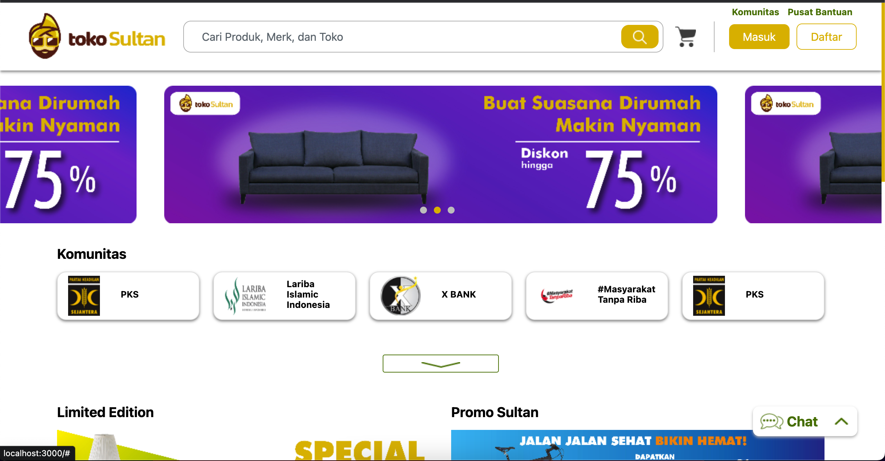

# Toko Sultan Web

 
This is a Toko Sulta Web application that demonstrates the basics of building a single-page app using React, JSX, and React Router.

## Prerequisites
Before you begin, make sure you have the following software installed on your computer:
- [Node.js v14.17.6](https://nodejs.org/dist/v14.17.6/)
- [npm](https://www.npmjs.com/)

## Installation
Step-by-step instructions to install and run the project:
1. Clone the repository:
`git clone https://gitlab.com/falihnaufal17/toko-sultan-web.git`
2. Change into the project directory:
`cd toko-sultan-web`
3. Install the dependencies:
`npm install`

## Running The Project
To run the project, use the following command:
`npm start`  
This will start a development server and the project will be available at [http://localhost:3000](http://localhost:3000) in your browser.

## Deployment

To create a production build of the project, use the following command:
`npm run build` 
This will create a production-ready build in the `build` directory, which you can then serve using a web server of your choice.

## Contributing

If you'd like to contribute to the project, please follow these steps:
1. Fork the repository
2. Create a branch for your changes
3. Commit your changes
4. Push to the branch
5. Submit a pull request

## License

This project is licensed under the [MIT License](LICENSE).